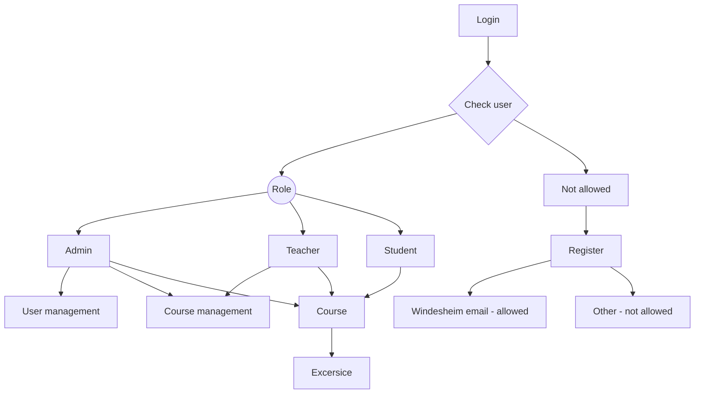

# Welkom bij DOMP

Dit md document bevat de begeleiding voor de module DOMP. In deze module gaan we per groep een Scrum review applicatie maken. Deze applicatie gaat een onderdeel van het scrum proces digitaliseren.
Voordat we de diepte ingaan hoe we dit voor elkaar gaan krijgen ga ik zorgen dat jullie allemaal op één punt kunnen beginnen.

# Stappen.
#### Created by: Stephan Hoeksema 2022  ScrumReview

### Stap 01 - Installeer git
- Check versie git op de command-line/terminal (git --version);
- Maak op gitlab het project scrumreview aan.
 
### Stap 02 Installeer MariaDB/MySQL
- check versie MarieDB/MySQL op de command-line/terminal door in te loggen op de command-line/terminal met: mysql -u<jouw_username> -p<jouw_password>   DAY
- Maak op de command-line/terminal wanneer je ingelogd bent, de volgende database aan: 
  - create database scrumReview*; 

### Stap 03 Landing page
- Pak de domp.zip uit. Hier staat een index.php in en een views directory met allemaal bestanden.  Zet deze in de root van je project directory. 

#### Stap 04 Zorg voor een view van de landing page.
- in de views directory staat index,view.php 
- Onderaan in de index.php doen we een require van de 'views/index.view.php'. vergeet de ';' niet! 
- Run het door een localhost op te zetten op 9595. 

### Stap 05 Zorg voor een database connectie.
- Ga naar Tools -> database in phpStrom.
- Druk op + symbool kies datasource 
- Gegevens voor mysql/mariadb invoeren 
- Voordat je op 'apply' drukt even op 'test' drukken om te kijken of het werkt. 
- In de **views** directory staat een bestand **domp.sql**. 
- Open de domp.sql en voer de commands step **01** t/m step **03** uit.

### Stap 06 Database class
- Zorg voor een database connectie door middel van een class: 
- Maak de directory 'database' 
- Maak een nieuwe php class Connection.php in deze directory 
- Maak variabele voor de gegevens: 
  - host 
  - dbname 
  - user 
  - password 
- Maak een try...catch... block 
  - Probeer(try) een PDO connectie te maken 
  - Vang(catch) de error messages 
  - Test het door een nieuwe connectie te maken in de index.php 
    - in index.php: require 'database/Connection.php';
    - $conn = Connection::make(); 
    - die(var_dump($conn)); 
              
### Stap 07 Gebruikers 
- Gebruikers laten zien 
- $users = $pdo->allUsers() 
- Users in de view verwerken met een foreach() 

